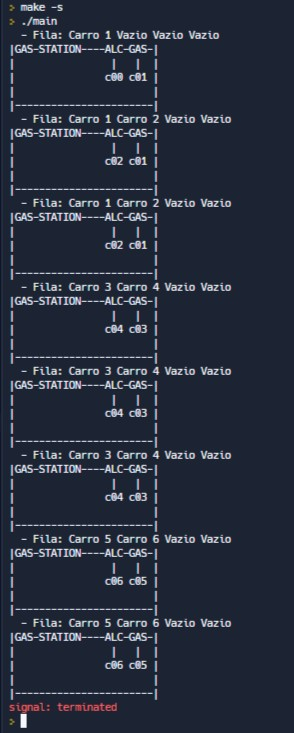

# mc504T1 Aluno: Pablo Areia Delgado

## Objetivo

Projeto Multithread:  implementação de uma aplicação multithread que utiliza semáforos e/ou mutex locks e variáveis de condição para sincronização e de um visualizador para o progresso desta aplicação.

## Descrição

O problema pensado é baseado num posto de gasolina que contém 2 bombas, uma de gasolina, e outra de gás. No problema existem carros movidos somente a cada um destes combustíveis.

Somado a isso, o posto consegue comportar uma fila de espera de até 4 carros. Ou seja, se um carro chegar e as bombas tiverem ocupadas e a fila cheia, este carro vai embora.

Vale destacar que essa fila é compartilhada entre carros dos dois tipos de combutível. Se um carro movido a gasolina chegar e a bomba da gasolina tiver sendo ocupada e tiver uma fila de 4 carros movidos a àlcool. Ele deve ir embora mesmo assim.

## Sobre o Conceito Abordado

Este problema contempla 3 mutexes (um para cada bomba e um para a fila de carros) e uma variável de condição relacionada à fila.

É um problema que trata sincornização e pode ser facilmente escalável:
 - Adicionando uma bomba com diesel por exemplo;
 - Ou adicionando veículos diferentes que podem ocupar diferentes quantias de espaço na fila;
 - Ou aumentando bombas de mesmo combustível elevando o número de recursos por tipo de carro;

## imagem de um log teste

